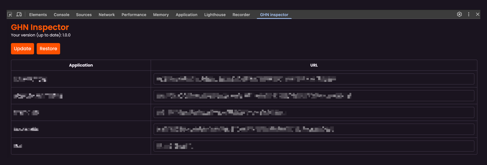

[](https://github.com/comehere127/ghn-inspector/actions/workflows/build.yml)

# GHN Inspector

A Firefox/Chrome devtools extension to provide utilities for helping with Portal Mini Applications.



## 🚀 Installation

You can install the latest version of the Inspector devtools using the links below:

- [Get GHN Inspector for Chrome](https://chromewebstore.google.com/detail/ghn-inspector/hbfjhefhdggcgehngdldljifmdkpiign)
- [Get GHN Inspector for Firefox](https://addons.mozilla.org/en-US/firefox/addon/ghn-inspector/)

This is the recommended installation method.

## 🔧 Manual Installation

You can download the bundled extension for your browser from the github releases page [here](https://github.com/comehere127/ghn-inspector/releases).

_NOTE: Auto-update will not work with manual installations._

- ### Chromium Based Browsers (Chrome, Edge, Opera)

    1. Visit: [`chrome://extensions`](chrome://extensions) or [`edge://extensions`](edge://extensions) or [`about://extensions`](about://extensions) (in opera).
    2. Enable `Developer Mode`
        - Chrome/Opera: The toggle button is in the top-right corner
        - Edge: The toggle button is in the left sidebar
        - Refresh the page!
    3. Drag & drop the `.zip` file you downloaded into the page.

- ### Firefox

    1. Get an [ESR](https://www.mozilla.org/en-US/firefox/enterprise/), [Developer](https://www.mozilla.org/en-US/firefox/developer/), or [Nightly build](https://www.mozilla.org/en-US/firefox/channel/desktop/#nightly) of firefox.
    2. Follow Mozilla's instructions to enable installing unsigned addons [here](https://support.mozilla.org/en-US/kb/add-on-signing-in-firefox#w_what-are-my-options-if-i-want-to-use-an-unsigned-add-on-advanced-users).
        - Visit [`about:config`](about:config)
        - Set `xpinstall.signatures.required = false`
        - Set `extensions.langpacks.signatures.required = false`
    3. Visit [`about:addons`](about:addons)
    4. Drag & drop the `firefox.xpi` file you downloaded into the page.

## 🐛 Bugs

Please file an issue [here](https://github.com/comehere127/ghn-inspector/issues) for feature requests, bugs, missing documentation, or unexpected behavior.

## 🖥️ Developing

Ensure you have:

- [Node.js](https://nodejs.org) 14 or later installed
- [Yarn](https://yarnpkg.com) v1 or v2 installed

Then run the following:

- `yarn install` to install dependencies.
- `yarn run dev:chrome` to start the development server for chrome extension
- `yarn run dev:firefox` to start the development server for firefox addon
- `yarn run build:chrome` to build chrome extension
- `yarn run build:firefox` to build firefox addon
- `yarn run build` builds and packs extensions all at once to `extension/` directory

### Test in Dev Mode

1. `yarn install` to install dependencies.
2. `yarn run dev:chrome` or `yarn run dev:firefox` To watch file changes in development
3. Load the extension in your browser

    _NOTE: Remove any existing versions first_

   #### Chrome

    - Go to the browser address bar and type `chrome://extensions`.
    - Check the `Developer Mode` button to enable it.
    - Click on the `Load Unpacked Extension…` button.
    - Select the folder `inspector/extension/chrome`.

   #### Firefox [ESR](https://www.mozilla.org/en-US/firefox/enterprise/), [Developer](https://www.mozilla.org/en-US/firefox/developer/), or [Nightly build](https://www.mozilla.org/en-US/firefox/channel/desktop/#nightly)

    - Go to the browser address bar and type `about:debugging#/runtime/this-firefox`.
    - Click on the `Temporary Extensions` Section, then the `Load Unpacked Extension…` button.
    - Select the file `inspector/extension/firefox.xpi`.

### Test Prod builds

- `yarn run build` builds the extension for all the browsers.

Note: By default the `package.json` and `manifest.json` are set with version `0.0.0`. The CI pipeline will set the version before building the bundles.

### Generating browser specific manifest.json

Update `source/manifest.json` file with browser vendor prefixed manifest keys

```js
{
  "__chrome__name": "SuperChrome",
  "__firefox__name": "SuperFox",
  "__edge__name": "SuperEdge",
  "__opera__name": "SuperOpera"
}
```

if the vendor is `chrome` this compiles to:

```js
{
  "name": "SuperChrome",
}
```

Add keys to multiple vendors by separating them with | in the prefix

```
{
  __chrome|opera__name: "SuperBlink"
}
```

if the vendor is `chrome` or `opera`, this compiles to:

```
{
  "name": "SuperBlink"
}
```

See the original [README](https://github.com/abhijithvijayan/wext-manifest-loader) of `wext-manifest-loader` package for more details

## License

[MIT ©](https://github.com/comehere127/ghn-inspector/blob/master/LICENCE)
